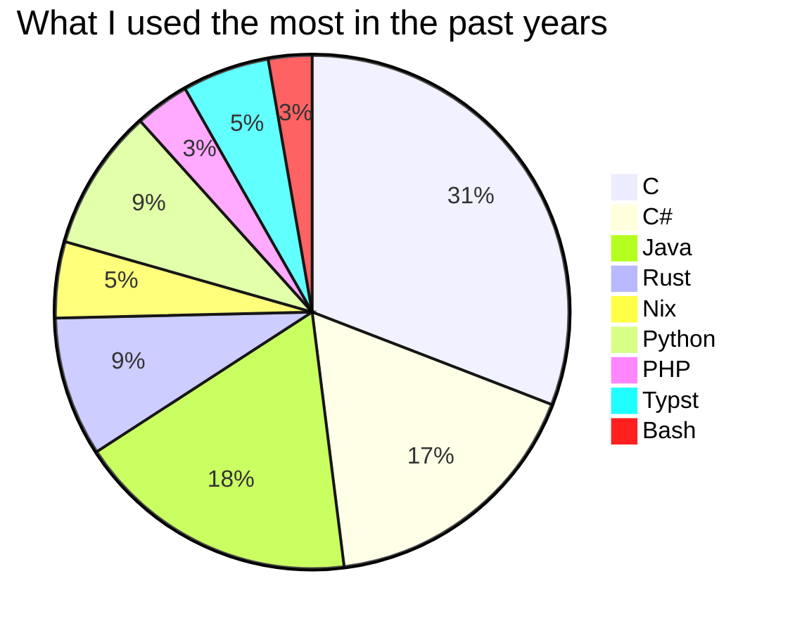
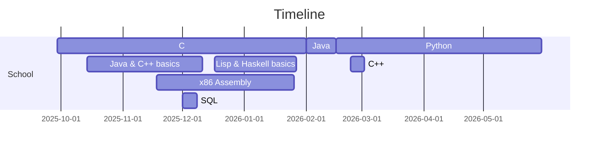
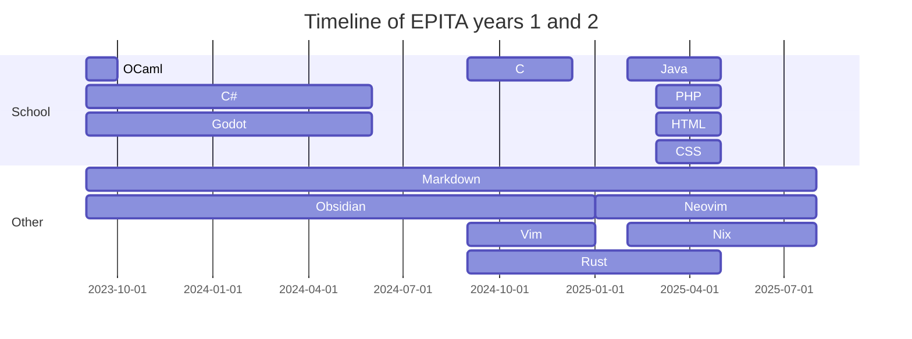

I'am Alexis Fouquet, a french student at the computer science school
[EPITA](https://www.epita.fr/en/). I am using this page to showcase some of my
projects. As I must keep most of them private, not all of my projects will have
a link to the source code.

# A list of technologies

A small list of what I use the most.

Excluding Markdown, I mostly use these languages:

## This year at school

This year, I mainly used **C** and **Java**. With more 300 hours on C on my
Wakatime, I learned from many projects.

Java was my first programming language, and this year I learned how to use some
frameworks and libraries like lombok and the basics of quarkus.

We also used Python, SQL (PostgreSQL), C++ and many others.

## Before this year

This section is approximated. You may need to scroll down. _Work in progress._

# Public projects

## My NixOS config

When I switched to Linux, I started by using Ubuntu. Then, I started to use the
[Nix](https://nixos.org/) package manager to synchronise my configuration at
home with the one on school's computers. I finished by using NixOS at home.

The main purpose of this choice is reproducibility : I am using the same
configuration on every computer, with the exact same applications that I like.
This configuration is written in Nix, a functionnal programming language
created by NixOS.

You can find my configuration on this
[link](https://github.com/Alexis-Fouquet/home). As this is configuration as
code I can showcase it as a project.

## My CV

I have a public CV made in Typst, a LaTeX alternative. You can find the code
on this [repository](https://github.com/Alexis-Fouquet/public-cv). This allows
me to easily edit the whole style of my resume.

## Testing pytorch

This year, I am also learning Machine Learning for a research program in my
school, where we help researchers on one of their subjects.

To test pytorch and learn how to train models, I have created a
[repository](https://github.com/Alexis-Fouquet/testing-pytorch)
where I put all my experiments. You can use `pytest` and `tensorboard` to see
the result easily. A `flake.nix` is provided to install everything.
Each model will have a folder in the `runs` folder.

The purpose of this repository is to evolve to include many models, while
being as generic as possible.

